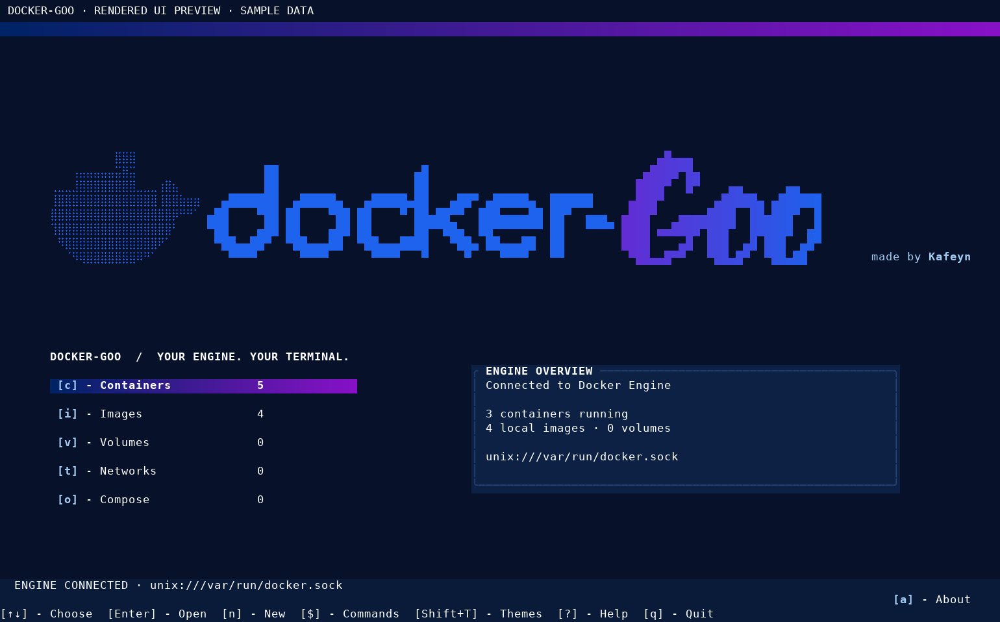
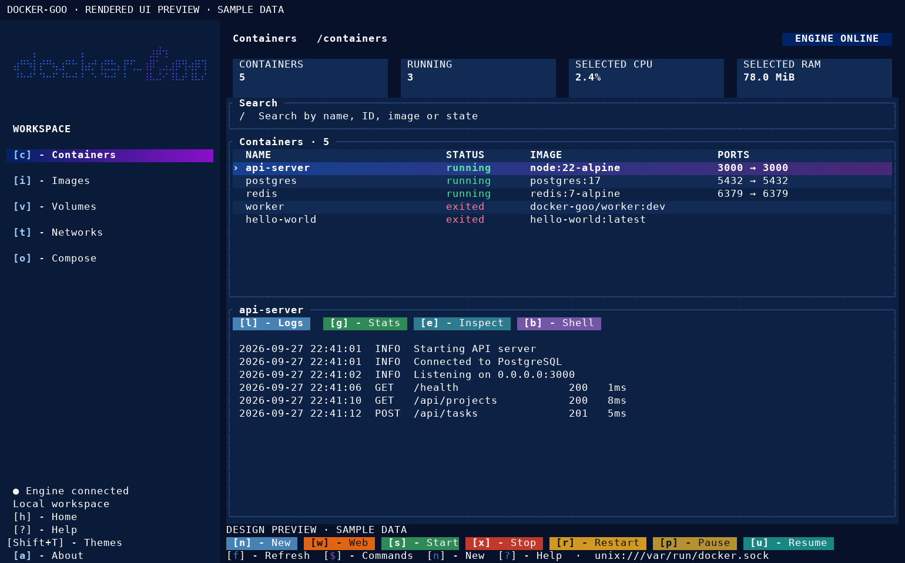
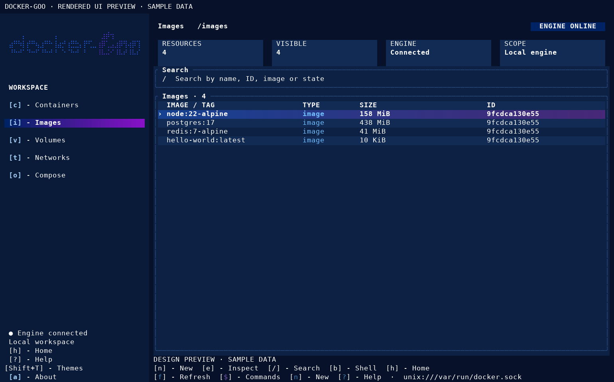
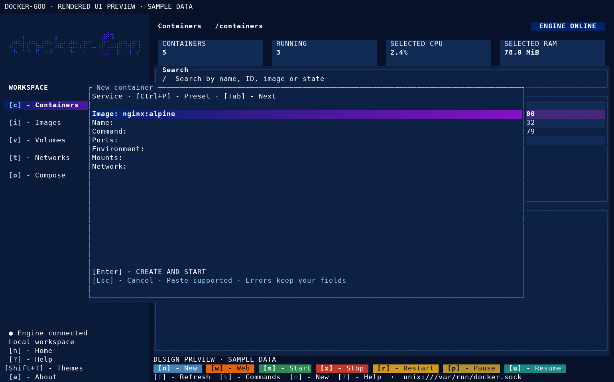
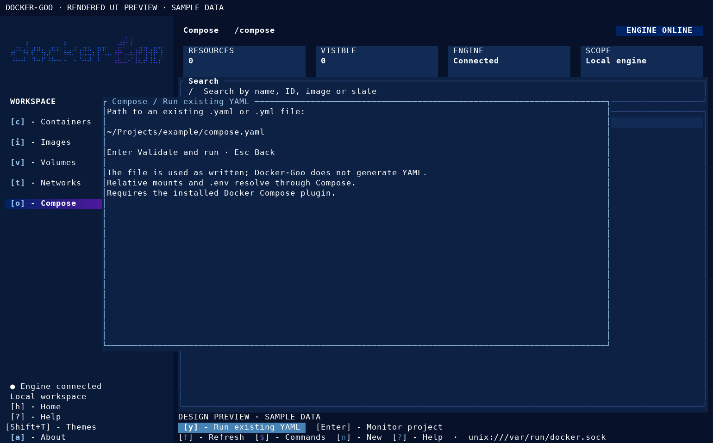
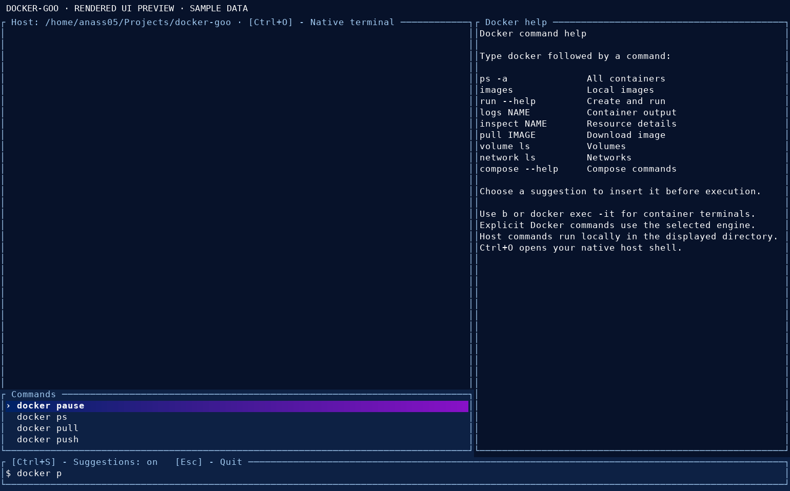
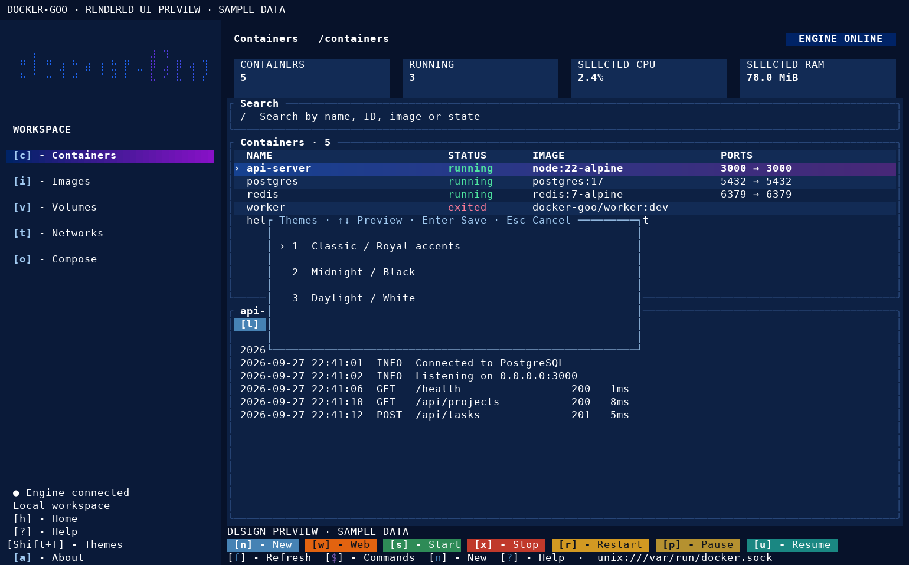

<div align="center">

&nbsp;&nbsp;&nbsp;&nbsp;

### Your Docker workspace. Inside your terminal.

A Linux-first terminal interface for managing your existing Docker Engine.

[](#installation)
[](#development)
[](LICENSE)

[Installation](#installation) · [Features](#features) · [Shortcuts](#keyboard-shortcuts) · [Screenshots](#screenshots) · [Report an issue](https://github.com/kurapikanlight/docker-goo/issues)



</div>

---

Docker-Goo brings familiar Docker Desktop workflows into a full-screen terminal interface: browse containers, follow logs, watch resource usage, open shells, and run Compose projects.

It connects to the Docker Engine already installed on your system. It does not bundle a daemon or require Docker Desktop.

**No Docker-Goo account. No subscriptions. No telemetry. No cloud dependency.**

> Early release. Build and run locally on Linux. Distribution-specific installation commands are provided below; compatibility across every distribution and terminal is still being validated.

## Features

| Workspace | What you can do |
| --- | --- |
| **Containers** | Browse states, start, stop, restart, pause, resume, inspect, and delete stopped containers |
| **Create** | Choose a local image; configure name, command, ports, environment, mounts, and network |
| **Logs** | Follow live output from the selected container |
| **Stats** | View CPU usage, memory, and cumulative network traffic |
| **Images** | Browse local images, inspect details, and use an image to create a container |
| **Volumes & networks** | Browse and inspect Docker resources |
| **Compose** | Run an existing YAML file and monitor its project containers |
| **Container shells** | Open Bash, sh, or a custom executable; use native interactive Docker sessions |
| **Web access** | Open a container's published web port in your browser |
| **Command console** | Run Docker and host commands with suggestions, editable input, and retained output |

Pulling/removing images, removing volumes/networks, pruning, and building images are available through Docker commands in the `$` console. Dedicated controls for these operations are not all implemented yet.

The interface includes mouse support, search, a permanent navigation drawer, three themes, and layouts that adapt to terminal size.


It launches by:


```bash
docker-goo
```


## Installation

### 1. Check Docker

Install **Docker Engine** using the instructions for your distribution:

- [Fedora](https://docs.docker.com/engine/install/fedora/)
- [Ubuntu](https://docs.docker.com/engine/install/ubuntu/)
- [Debian](https://docs.docker.com/engine/install/debian/)
- [Other distributions and derivatives](https://docs.docker.com/engine/install/)

For Arch, openSUSE, and NixOS, use your distribution's Docker package/module. Linux Mint users should follow the instructions appropriate to their Ubuntu or Debian base.

Verify that your normal user can access the intended engine:

```bash
docker info
```

Compose support additionally requires:

```bash
docker compose version
```

For access setup, see Docker's [Linux post-installation guide](https://docs.docker.com/engine/install/linux-postinstall/) or [rootless mode](https://docs.docker.com/engine/security/rootless/). Membership in the `docker` group grants root-level privileges.

### 2. Install build tools

Choose your distribution.

**Ubuntu · Debian · Linux Mint**

```bash
sudo apt update
sudo apt install -y build-essential curl git
```

**Fedora**

```bash
sudo dnf install gcc make curl git
```

**Arch Linux**

```bash
sudo pacman -S --needed base-devel curl git
```

**openSUSE**

```bash
sudo zypper install gcc make curl git
```

**NixOS**

Use a development shell and follow the NixOS Rust guidance:

```bash
nix-shell -p rustup gcc git pkg-config
rustup default stable
```

Run the installation commands below inside that shell. See the [NixOS Rust guide](https://wiki.nixos.org/wiki/Rust) for a persistent development environment.

### 3. Install Rust

The current project requires **Rust 1.98 or newer**.

On conventional Linux distributions, install Rust using [rustup](https://rust-lang.org/tools/install/):

```bash
curl --proto '=https' --tlsv1.2 -sSf https://sh.rustup.rs | sh
```

Restart your terminal, then verify:

```bash
rustc --version
cargo --version
```

If you already use rustup, update your stable toolchain:

```bash
rustup update stable
```

### 4. Install Docker-Goo

```bash
git clone https://github.com/kurapikanlight/docker-goo.git
cd docker-goo
cargo install --path . --locked
```

Launch from any directory:

```bash
docker-goo
```

Cargo installs the executable into `~/.cargo/bin`. If the command is not found, ensure that directory is in your shell's `PATH`.

For Bash or Zsh, you can load Rust's environment into the current terminal:

```bash
source "$HOME/.cargo/env"
```

No `sudo` is needed for the Cargo installation.

### Optional desktop integration

- **Open web ports:** install `xdg-utils` and configure a default browser.
- **Right-click / Ctrl+V clipboard paste:** install `wl-clipboard` on Wayland, or `xclip`/`xsel` on X11.
- Terminal-provided paste, commonly `Ctrl+Shift+V`, is also supported.

For example, on Fedora Wayland:

```bash
sudo dnf install xdg-utils wl-clipboard
```

Docker-Goo's core interface does not depend on GNOME, KDE, Hyprland, Sway, XFCE, or Cinnamon.

## First launch

```bash
docker-goo
```

1. Open **Containers** with `c`.
2. Select a container using the arrow keys.
3. Press `l` for logs, `g` for stats, or `e` for inspect.
4. Press `b` to choose a container shell.
5. Press `$` to open the command console.

Use a UTF-8 terminal with cursor support. A size of **100 × 30** or larger is recommended; the minimum is **50 × 15**. No Nerd Font is required.

The application uses the terminal's alternate screen. Normal exit restores your previous terminal view.

## Keyboard shortcuts

Shortcuts depend on the active page or dialog.

| Shortcut | Action |
| --- | --- |
| `[c]` | Containers |
| `[i]` | Images |
| `[v]` | Volumes |
| `[t]` | Networks |
| `[o]` | Compose |
| `[h]` | Home |
| `[↑ / ↓]` or `[j / k]` | Select a row |
| `[/]` | Search |
| `[Enter]` or `[e]` | Inspect selected resource |
| `[n]` | Create a container; on Compose, choose a YAML |
| `[s]` | Start selected container |
| `[x]` | Stop selected container |
| `[r]` | Restart selected container |
| `[p]` / `[u]` | Pause / resume |
| `[d]` | Delete a stopped container, with confirmation |
| `[l]` | Live logs |
| `[g]` | Live stats |
| `[b]` | Container shell options |
| `[w]` | Open a published web port |
| `[f]` | Refresh |
| `[$]` | Command console |
| `[Shift+T]` | Themes |
| `[a]` | About |
| `[?]` | Help |
| `[q]` | Quit |

## Create a container

Press `n`, choose an image, and configure the form.

| Field | Example |
| --- | --- |
| Image | `nginx:alpine` |
| Name | `my-web` |
| Ports | `8080:80` |
| Environment | `APP_ENV=development;TZ=UTC` |
| Mounts | `web-data:/data;/home/you/site:/usr/share/nginx/html:ro` |
| Network | An existing Docker network name |

Port mappings default to localhost. Use an explicit address such as `0.0.0.0:8080:80` if you intend to expose the service beyond your machine.

Use `Tab` to move between fields. Select **CREATE AND START** to submit. Errors stay visible and the form keeps your input so you can correct it.

`Ctrl+P` switches between Service and Shell presets. Missing images can be pulled during creation.

## Compose projects

Docker-Goo runs an existing `.yaml` or `.yml` file.

1. Press `o` to open Compose.
2. Press `y` to choose a YAML file.
3. Enter its path and press `Enter`.
4. After startup, monitor the project's containers.

Select a project and press `Enter` to view its containers. Press `c` to return to all containers.

The Docker Compose plugin validates the file and runs `up -d`. Your YAML, relative paths, and `.env` remain managed by Compose.

For other project operations, use the `$` console:

```bash
docker compose -f /path/to/compose.yaml ps
docker compose -f /path/to/compose.yaml down
```

## The `$` console

The console supports Docker commands and ordinary host commands such as `pwd`, `ls`, and `cd`.

```bash
docker pull ubuntu:24.04
docker ps -a
docker volume ls
docker network ls
```

- Arrow keys move the editing cursor.
- Docker command suggestions include relevant local images and containers.
- YAML and Dockerfile suggestions appear in supported file argument positions.
- `Enter` or `Tab` accepts a selected suggestion; it does not execute it.
- `Ctrl+S` toggles suggestions.
- Output streams live and previous command results remain separated.
- `PgUp` / `PgDn` scroll output.
- `Ctrl+C` cancels the current console command.
- `Esc` returns to the dashboard.
- `Ctrl+O` opens a native host shell.

Open Docker-Goo directly in the console from your current directory:

```bash
docker-goo --console
```

Or specify a directory:

```bash
docker-goo --console --cwd ~/Projects/my-app
```

### Interactive Ubuntu shell

```bash
docker run -dit --name goo-ubuntu ubuntu:24.04 sleep infinity
docker exec -it goo-ubuntu bash
```

Native interactive commands temporarily hand over the terminal. Type `exit` or use the shell's `Ctrl+D` behavior to return.

For Docker-Goo's API container terminal, `Ctrl+D` detaches. Type `exit` first when you want to end that shell process.

## Docker connections

Docker-Goo supports the standard Docker socket, rootless Docker, environment variables, and Docker contexts.

```bash
docker-goo --check
docker-goo --context my-context
docker-goo --host unix:///var/run/docker.sock
docker-goo --host "unix:///run/user/$(id -u)/docker.sock"
```

Connection selection follows:

1. Explicit `--host`.
2. Explicit `--context` or `DOCKER_CONTEXT`.
3. `DOCKER_HOST`.
4. A configured current non-default Docker context.
5. An available rootless socket.
6. `/var/run/docker.sock`.

SSH and certificate-authenticated TLS endpoints are implemented. Remote setups still require testing against your environment.

## Appearance

Press `Shift+T` to choose **Classic**, **Midnight**, or **Daylight**.

Docker blue and purple accents unify the drawer, highlighted selections, and animated wordmark. Theme selection is saved locally.

Disable logo animation:

```bash
DOCKER_GOO_STATIC=1 docker-goo
```

Request monochrome output:

```bash
NO_COLOR=1 docker-goo
```

## Screenshots

The previews below use sample data.

### Containers



<details>
<summary><strong>Explore more screens</strong></summary>

### Images


### Create a container


### Compose


### Command console


### Themes


</details>

## Update

From your cloned repository:

```bash
git pull --ff-only
cargo install --path . --locked --force
```

## Uninstall

```bash
cargo uninstall docker-goo
```

Uninstalling Docker-Goo does not remove Docker Engine, containers, images, volumes, or networks.

## Troubleshooting

| Problem | Check |
| --- | --- |
| `docker-goo: command not found` | Ensure `~/.cargo/bin` is in `PATH` |
| Rust version rejected | Update Rust and check `rustc --version` |
| Engine offline | Run `docker info` and `docker-goo --check`; check daemon, socket permissions, and context |
| Compose unavailable | Verify `docker compose version` |
| Browser does not open | Install `xdg-utils`; check the port serves HTTP/HTTPS |
| Clipboard paste unavailable | Install the clipboard helper appropriate to Wayland or X11 |
| Bash is missing inside a container | Try `sh`, or another executable installed in that image |
| Empty or cramped panels | Enlarge the terminal |
| CPU exceeds 100% | Containers can use multiple CPU cores |
| Network counters keep increasing | They show cumulative bytes, not transfer rates |

## Development

Built with Rust, Ratatui, Crossterm, Bollard, and Tokio.

| Path | Purpose |
| --- | --- |
| `src/config/` | Arguments and Docker connection discovery |
| `src/core/` | Resource models and engine interface |
| `src/core/docker/` | Docker Engine implementation |
| `src/tui/` | Rendering, navigation, dialogs, and terminal sessions |
| `assets/` | Terminal logo assets |

```bash
cargo run --locked
cargo fmt --check
cargo build --locked
```

## Feedback

Found a bug? [Open an issue](https://github.com/kurapikanlight/docker-goo/issues) with your distribution, terminal, Docker version, steps to reproduce, and relevant error output. Remove secrets before sharing logs or inspect output.

## License & credits

Released under the [MIT License](LICENSE).

Created by **[Anass Iguedmi — Kafeyn](https://github.com/kurapikanlight)**.

Docker-Goo is an independent project and is not affiliated with or endorsed by Docker, Inc.
